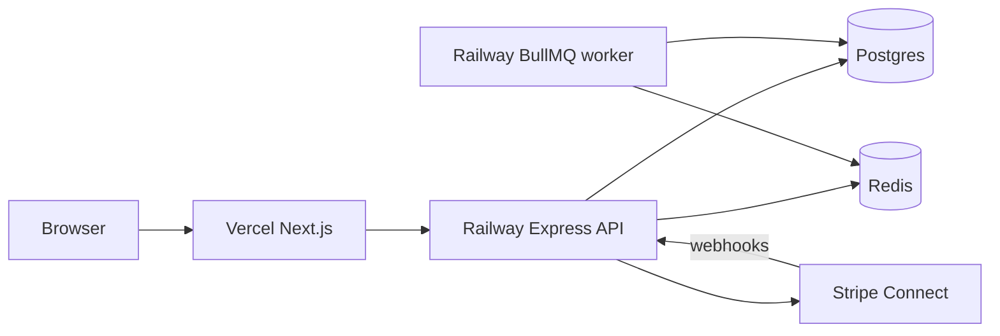

# CraftHub

[](https://github.com/hamzasyed2985/crafthub/actions/workflows/ci.yml)

Local-artisan **multi-vendor marketplace**: independent sellers run storefronts, manage inventory, and get paid out after CraftHub takes a commission.

**Live demo:** [https://crafthub-api-five.vercel.app](https://crafthub-api-five.vercel.app)  
**API:** `https://api-production-f1f6.up.railway.app` (`/health`, `/ready`)

## Case study (portfolio)

### Problem
Local makers need a shared storefront with real checkout, per-vendor payouts, and admin controls — without standing up a full microservice fleet.

### Approach
A **modular monolith**: Next.js storefront (Vercel) + Express API + BullMQ worker (Railway) on Postgres + Redis. Shared Zod schemas, Prisma domain models, Stripe Connect for marketplace money movement, and optional Groq-backed listing/search assistants.



### Why not microservices yet
Connect webhooks, inventory reservations, and vendor ledgers share one transaction boundary. Splitting checkout across services early adds ops cost without portfolio upside. Queues isolate slow work (email, embeddings, reservation TTL) without network hops for every request.

### Tradeoffs
| Choice | Upside | Cost |
|--------|--------|------|
| Modular monolith | Fast delivery, one deploy story for API | Scale vertical first |
| Redis + BullMQ | Reliable delayed jobs | Not used as a response cache |
| Stripe mock adapter | E2E without keys | Flip to test keys for real Checkout |
| Groq free chat | Concierge/copilot without OpenAI spend | Rate limits; embeddings stay mock unless OpenAI |

### Loom script (record ~3–5 min)
1. **Buyer** — Explore → product → cart → checkout (mock or test card) → order page  
2. **Vendor** — login pottery → orders → mark shipped with tracking → earnings  
3. **Admin** — metrics → finance → approve a pending vendor (optional)  
4. **AI** — Concierge ask for a mug; vendor “Generate listing” from notes  

Seed logins are below (intentional demo accounts for the portfolio URL).

## Documentation

All project specs live in **[docs/](./docs/README.md)** — one topic per file.

Start here: [docs/01-overview.md](./docs/01-overview.md) · Deploy: [docs/13-deployment.md](./docs/13-deployment.md) · **What’s left (optional engineering polish):** [docs/16-production-readiness.md](./docs/16-production-readiness.md)

## Stack

Next.js · Tailwind CSS · Express · PostgreSQL · Redis · BullMQ · Stripe Connect · Docker · GitHub Actions · TypeScript · Sentry (optional DSN)

## Repo layout

```
apps/
  web/       # Next.js (buyer, vendor, admin)
  api/       # Express API
  worker/    # BullMQ consumers (reservation expiry, email, embeddings)
packages/
  db/        # Prisma schema + client
  shared/    # Zod schemas, enums
  ui/        # Design tokens + primitives
infra/docker/
docs/
tests/e2e/   # API end-to-end suites
```

## Local setup

Prerequisites: Node 20+, Docker Desktop, [pnpm](https://pnpm.io) 9+.

```bash
cp .env.example .env
docker compose -f infra/docker/docker-compose.yml up -d
pnpm install
pnpm db:generate
pnpm db:push
pnpm db:seed
pnpm --filter @crafthub/shared build
pnpm dev:api     # :4000
pnpm dev:web     # :3000
pnpm dev:worker  # reservation expiry (optional locally)
```

Seed accounts:

- Admin: `admin@crafthub.local` / `Admin123!`
- Buyer: `buyer@crafthub.local` / `Buyer123!`
- Vendor (pottery): `pottery@crafthub.local` / `Vendor123!` → `/shops/clay-ember`
- Vendor (wood): `wood@crafthub.local` / `Vendor123!` → `/shops/grain-groove`
- Vendor (jewelry): `jewelry@crafthub.local` / `Vendor123!` → `/shops/noor-atelier`
- Vendor (textiles): `textiles@crafthub.local` / `Vendor123!` → `/shops/loom-light`
- Vendor (food): `food@crafthub.local` / `Vendor123!` → `/shops/orchard-pantry`
- Pending vendor: `pending@crafthub.local` / `Vendor123!`
- Suspended vendor: `suspended@crafthub.local` / `Vendor123!`

Admin finance: `/admin/finance` (commission by vendor + sources). Seed includes orders across pending / paid / shipped / delivered / cancelled / refunded.

## Phase 3 — Checkout & Stripe Connect

**Charge model:** one platform Checkout Session per cart; **separate charges & transfers** after `checkout.session.completed`. Platform keeps `commission_bps` (default 10%); each vendor receives item net + their flat shipping via Connect transfer (`transfer_group = orderId`).

### Mock mode (default without keys)

`.env.example` sets `E2E_STRIPE_MOCK=1`. With an empty `STRIPE_SECRET_KEY`, the API uses a mock Stripe adapter:

1. Vendor → `/vendor/onboarding` → **Connect with Stripe** (enables `charges_enabled` immediately)
2. Buyer adds cart → `/checkout` → Pay → redirected to `/checkout/success`
3. Success page posts a mock webhook → order becomes `paid`, stock decrements, transfers recorded

### Real Stripe test mode

1. Put `sk_test_…`, `pk_test_…`, and `whsec_…` in `.env`; unset `E2E_STRIPE_MOCK` (or `0`)
2. Forward webhooks: `stripe listen --forward-to localhost:4000/webhooks/stripe` (local) or Dashboard → endpoint `https://YOUR-API/webhooks/stripe` (Railway)
3. Complete Express onboarding for each vendor, then pay with test card `4242 4242 4242 4242`

Never mark an order paid from the browser success URL alone — webhooks are the source of truth.

### E2E

```bash
# API running with mock Stripe
pnpm test:e2e
```

Verify:

- `GET http://localhost:4000/health` → `{ "status": "ok" }`
- Multi-vendor cart → checkout → paid order after webhook
- Vendor `/vendor/orders` shows paid slices

## Phase 4 — Vendor ops

Vendors fulfill paid slices (`paid` → optional `fulfilling` → `shipped`), optionally add tracking, and see earnings from DB aggregates (`/vendor/earnings`, dashboard widgets). Buyers see shipment status and tracking on order detail.

Verify: pay an order → vendor marks shipped with tracking → buyer order shows tracking; earnings net/gross update.

## Phase 5 — Admin finance + vendor debt ledger

Admin metrics, order refunds, commission settings, and audit log. Refunds always hit Stripe; if a vendor transfer already paid out, CraftHub records a **refund_debt** ledger entry and **nets it against the next payout** (no Stripe transfer reversal). Vendors over the debt threshold get `ledgerReviewRequired`.

Verify: refund a paid order → statuses sync; next sale’s transfer is reduced by outstanding debt.

## Phase 6 — Trust & polish

Reviews (after shipped purchase), `/search` + header search, email outbox templates (`order.paid` / `shipped` / `refunded` / `vendor.approved`), dark-mode token parity.

Automated verify: `pnpm test:e2e` → `trust-polish.e2e.test.ts` (search, review-after-ship, paid/shipped/refunded/approved outbox).

### Demo script

1. Toggle **Dark** in the header — surfaces/text stay readable  
2. Search “mug” or “Islamabad” from `/search`  
3. Buyer: cart → checkout → pay (webhook) → vendor ships with tracking  
4. Buyer reviews the product on the PDP (verified purchase)  
5. Admin: `/admin` metrics → refund an order → vendor debt appears on earnings  
6. Check API logs / `email_outbox` for mock emails after pay/ship/refund/approve  

## Phase 6.5 — AI (Craft Concierge + Listing Copilot)

Grounded retrieval over catalog embeddings (mock by default). **Chat** uses free **Groq** when `GROQ_API_KEY` is set (`E2E_AI_MOCK=0`).

```bash
# 1. Create a free key at https://console.groq.com/keys
# 2. In .env / Railway API:
#    GROQ_API_KEY=gsk_...
#    E2E_AI_MOCK=0
# 3. Restart / redeploy the API

# Optional: sync-index embeddings as admin
# POST /api/v1/ai/embeddings/reindex?sync=1

pnpm test:e2e -- tests/e2e/ai.e2e.test.ts
```

Verify:

1. Floating **Craft Concierge** → ask for a ceramic mug → product cards with DB prices  
2. Vendor → **New product** → Generate listing from notes → edit before save  
3. Admin reindex reports embeddings ≈ active products  

See [docs/15-ai-features.md](./docs/15-ai-features.md).

## Phase 7 — Deployed demo

| Piece | Host |
|-------|------|
| Web | Vercel (`apps/web`) |
| API + worker | Railway (Dockerfiles under `infra/docker/`) |
| Postgres + Redis | Railway plugins |
| Errors | Sentry when `SENTRY_DSN` is set on the API |

`NEXT_PUBLIC_API_URL` must include `https://`. Railway `APP_URL` / `CORS_ORIGIN` must match the Vercel origin exactly.

## Roadmap

See [docs/14-roadmap.md](./docs/14-roadmap.md).
